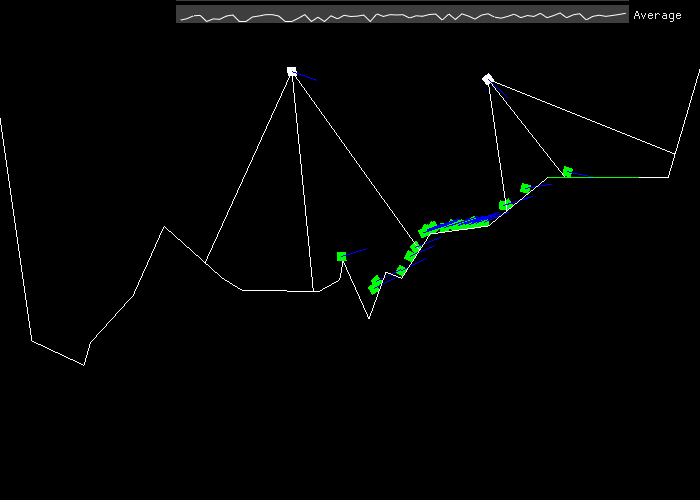

# Machine Learning - Lunar Lander

This is a small toy project abotu machine learning.
It has been designed to allow multiple environement for the agent but the only one available for the moment is a Lunar-Lander-like game.

To compile it you will need SFML, ImGui and ImGui's SFML binding.

# Behavior

Of course this is not a finished project and still need some polishing, especially some fine tunning for the agents.
At the moment of writing this the agents always develop the same behavior.

They just keep rotating at all time in the same direction no matter what.
When they are facing toward the landing pad they then activate their thruster.

This gives rise to a really weird and jerky movement.
I believe that adjusting the inputs and/or the altering slightly the mechanic of the game would make it possible to see emerge more complexe and suitable behavior.

free low res 8 FPS gif(t)  
*Note that begin too lazy to let them run longer this a pretty young generation and thus this is not the best they get* 

# Inputs\Outputs

The agent have a couple of inputs and outputs, for the lunar lander environment they are the following:

As Inputs they receive, all normalized from -1 to + 1
- their rotation
- velocity
- velocity along the X axis
- velocity along the Y axis
- the direction toward the landing pad
- the distance toward the landing pad
- the direction toward the alnding pad along the X axis
- the direction toward the alnding pad along the Y axis

and in adition they have a couple of ray sent from their base so that they can sens the distance to ground

And as output they have

- rotation, a float between -1 and +1, at each step if the the absolute of rotation is superio to 0.5 they will rotate from rotation * ROTATION_RATE
- thruster, about the same, if thruster > 0.5 then a force of thruster * THRUSTER_RATE is applied in the direction opposing their facing

# Keybindings

- V - toggle frame cap, I suggest hitting this so the simulation go as fast as possible
- R - toggle rays rendering
- T - toggle all drawing, when not drawing the simulation goes wayyyyy faster
